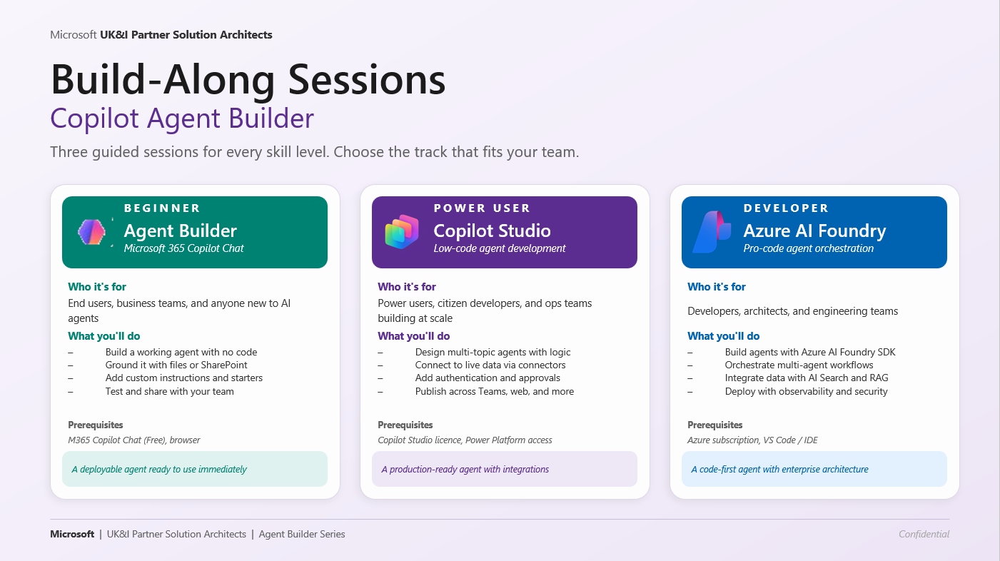

# Agent Build-Along Series

> **Choose your tier. Build it. Ship it.**
> A self-serve service for producing engaging, industry- and function-specific Agent Build-Along sessions across the Microsoft platform stack.

**Microsoft 365 Copilot · Copilot Studio · Azure AI Foundry**

[]()
[]()
[]()

---

## What is this?

A guided workshop series for **everyone in your organisation** — from business makers to professional developers — where we build a working agent together at the right tier of the Microsoft platform stack.

This repo is the **self-serve generator** behind the series: pick an industry, pick a function, pick a tier, and produce a ready-to-run Build-Along session — complete with scenario, scaffolding, sample data, and facilitator narrative.

Walk away with a deployable agent and the confidence to build more.

---

## Three Tiers — Meet Builders Where They Are




| Tier | Platform | Audience | Duration | Approach |
|------|----------|----------|----------|----------|
| **1 — Foundation** | Microsoft 365 Copilot Agent Builder | Business makers, end users, departmental teams | 60 min | No-code |
| **2 — Extend** | Copilot Studio | Citizen developers, power users, ops teams | 90 min | Low-code |
| **3 — Pro-Code** | Azure AI Foundry | Pro developers, architects, AI engineers | 180+ min | Code-first |

---

## Tier 1 — M365 Copilot Agent Builder

**Author your first agent — no code required.**

**What we'll build**
- A custom agent scoped to a real workplace scenario
- Grounded with knowledge sources (SharePoint sites, files, web URLs)
- Configured with custom instructions and conversation starters
- Tested in the preview pane and shared with your team

**Session flow:** Define → Ground → Refine → Test & Share

**Prerequisites**
- Microsoft 365 Copilot licence (or Copilot Chat free)
- Modern browser (Edge / Chrome)
- A workplace scenario in mind (or use our template)

**You'll walk away with** a working agent you can use immediately, plus a repeatable pattern for future use cases.

---

## Tier 2 — Copilot Studio

**Orchestrate multi-step agents across enterprise systems.**

**What we'll build**
- A copilot with generative answers and authored topics
- Custom actions that call APIs and Power Platform connectors
- Knowledge sources (SharePoint, Dataverse, public web, enterprise data)
- Channel deployment to Microsoft Teams and a public web embed

**Session flow:** Design → Connect → Author → Publish

**Prerequisites**
- Copilot Studio access or trial environment
- Familiarity with Power Platform helpful (not required)
- A multi-step workflow or process in mind

**You'll walk away with** a published copilot running in Teams or on the web, plus a pattern for connecting copilots to enterprise systems.

---

## Tier 3 — Azure AI Foundry

**Ship a code-first agent with evaluations and observability.**

**What we'll build**
- A code-first agent with custom tools and function calling
- Grounding via Azure AI Search and your own data
- Model selection from the Foundry catalog (with optional fine-tuning)
- Evaluations, tracing, and managed-identity deployment

**Session flow:** Provision → Build → Evaluate → Deploy

**Prerequisites**
- Azure subscription with Azure AI Foundry access
- VS Code, plus Python or .NET familiarity
- Sample data or a use case ready to ground on

**You'll walk away with** a deployed agent with code, evaluations, and tracing in place — plus reusable SDK templates.

---

**Pick an industry** (Financial Services, Healthcare, Retail, Manufacturing, Public Sector, Energy, Professional Services)
→ **Pick a function** (Sales, Marketing, Finance, HR, Operations, IT, Customer Service)
→ **Pick a tier** (1, 2, or 3)
→ **Generate** a ready-to-run Build-Along session.

---

## Getting Started

### Prerequisites

- [Add prerequisite — e.g., Node.js 20+ / Python 3.11+]
- [Add prerequisite — e.g., access to template repository]

### Quick Start

```bash
# Clone the repo
git clone https://github.com/[your-org]/agent-build-along.git
cd agent-build-along

# Install dependencies
[add install command]

# Generate your first Build-Along
[add run command]
```

---

## Next Steps — Join or Host a Build-Along

1. **Pick your tier** — Start where your skills are today. Move up the pyramid as you grow.
2. **Reserve a seat** — Register via the rollout calendar — sessions run on a rolling schedule throughout 2026.
3. **Show up & build** — Bring a real scenario. Leave with a working agent you can share.

---

## Repository Structure

```
agent-build-along/
├── tiers/
│   ├── tier-1-agent-builder/      # M365 Copilot Agent Builder templates
│   ├── tier-2-copilot-studio/     # Copilot Studio templates
│   └── tier-3-foundry/            # Azure AI Foundry templates
├── industries/                     # Industry scenario libraries
├── functions/                      # Function-specific overlays
├── generator/                      # Self-serve generation engine
├── assets/                         # Sample data, prompts, narratives
└── examples/                       # Sample generated sessions
```

---

## Contributing

We welcome contributions across all three tiers:
- New industry × function scenarios
- Improvements to existing Build-Along templates
- Localization for EMEA languages
- Bug reports and feature requests

See [CONTRIBUTING.md](CONTRIBUTING.md) for details.

---

## Contact

**Questions, or to host a Build-Along for your team:**
**Brian O'Shea** — Sr Partner Solution Architect, CS Tech EMEA
[brianoshea@microsoft.com](mailto:brianoshea@microsoft.com)

Microsoft UK&I Partner Solution Architects · Agent Build-Along Series

